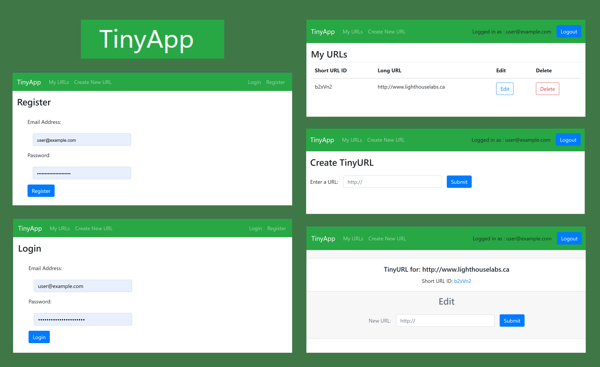
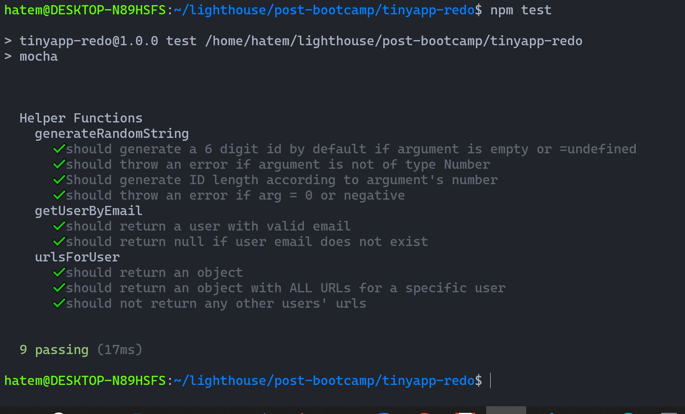

# ***TinyApp***

A full stack web app built with Node, Express, and EJS that allows users to shorten long URLs (à la bit.ly).
<!-- 
> [!IMPORTANT] :point_up:
> Key information users need to know to achieve their goal. -->

> [!TIP]
> 
> :bulb: Are you here to view this as a demo ? a Walkthrough with screenshots?
> - Navigate the web App :
>   - [>> Jump to : `USERGUIDE.md` >>](./assets/docs/USERGUIDE.md)
> - Stack & Dependencies, Dev Features, Routes, Sample API, Unit-Test : 
>   - [>> Jump to : `tech-specs.md` >>](./assets/docs/tech-specs.md)
> - See how the App was iteratevely build & Tagged (git)
>   - [>> Jump to : `CHANGELOG.md` >>](./CHANGELOG.md)


## Final Product


## **Getting Started**

1. Clone Project into your desired destination 
    
    ```bash
    git clone git@github.com:AH82/tinyapp.git
    ```
    
2. Install all dependencies 
    
    ```bash
    npm install
    ```
    
3. Run the development web server (on `/localhost:8080` )
    
    ```bash
    node express_server.js
    # or 
    npm start #invokes Nodemon.
    ```

4. *[optional]* Run the Test to make sure all is 'A' okay
    ```
    npm test
    ```
    > :bulb: See : [`tech-specs.md / ## Unit-Test`](assets/docs/tech-specs.md) for further details.

    
    

4. On your web-browser, go to : 
    - [`http://localhost:8080/login`](http://localhost:8080/login) , and follow the [`User Guide`](./assets/docs/USERGUIDE.md).


---

## Dependences and other Specs
> [!TIP]
> see : [`tech-specs.md`](./assets/docs/tech-specs.md) ▶ # Stack & Dependencies, # Dev Features, # Routes, # Sample API, # Unit-Test.

- ### Stack at a glance : 
  - Node
  - Express
  - EJS
  - No Database *( Hardcoded sample & in-memory thereafter )*
- ### Other Dependencies
    - `bcryptjs`
    - `cookie-session`
    - `~~cookie-parser~~` (for demo only, superceded by cookie-session)

## Change Log & Tags
> [!TIP]
> See how the App was iteratevely build & Tagged (git)
> - [>> Jump to : `CHANGELOG.md` >>](./CHANGELOG.md)
