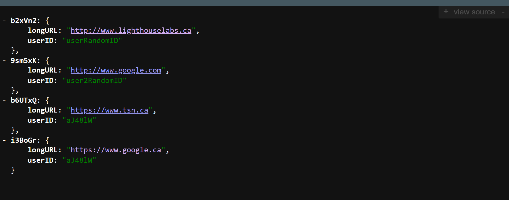

# TinyApp Web-App User Guide

> [!TIP]
> - [<< Back to : `README.md` << ](../../README.md) 
> - [>> Jump to  : `CHANGELOG.md` >> ](../../CHANGELOG.md) 
> - [>> Jump to : `docs/tech-specs.md` >> ](./tech-specs.md)

1. To start, you need to either Register, Login with a previously registered user, or use one of our demo users. 
    
    > [!CAUTION]
    Do not use your actual email or reuse any of your passwords. This is a demo project after all.
    > 
    > 
    > Use an made-up ones instead.
    > 
    - To Login with one of the demo users — press `Login` Link in the navigation bar or visit http://localhost:8080/login
        - Demo users :
            
            ```
            email: user@example.com
            pass: purple-monkey-dinosaur
            
            email: user2@example.com
            pass: dishwasher-funk
            ```
      


            
    - To Register — press the `Register` Link in the navigation bar or visit http://localhost:8080/register
      

2. You are now redirected to the your list of URLs (empty if you are new).
To come back at the this page at any time, Press `My URLs` in the Navigation bar.
  
    
3. Create a new URL — Head to `Create New URL` in the navigation bar.
    
    > [!NOTE]
    When you enter a new or edit a URL the address must start with `http://` or `https://.` 
    (e.g. "[http://www.example.ca](http://www.example.ca/) 👍  , not just "[www.example.ca](http://www.example.ca/)" 👎.)
    > 

     

4. To Edit (or view) any single URL — navigate through `My URLs` and press the corresponding `Edit` Button of that URL. — You’ll be redirected to an Edit page.
  

5. To Delete any single URL — navigate through `My URLs` and press the corresponding `Delete` Button of that URL.
6. To Logout, Press the `Logout` button in the Navigation bar.
7. …Voilà !

---

## Sample API 

As a demo courtesy, and a sample JSON API : 
→ 2 lists of hardcoded and thereafter in-memory databases of 

  - `Users` : visit → [`http://localhost:8080/users.json`](http://localhost:8080/users.json)
  - `URLs` : visit → [`http://localhost:8080/urls.json`](http://localhost:8080/urls.json)

  
  