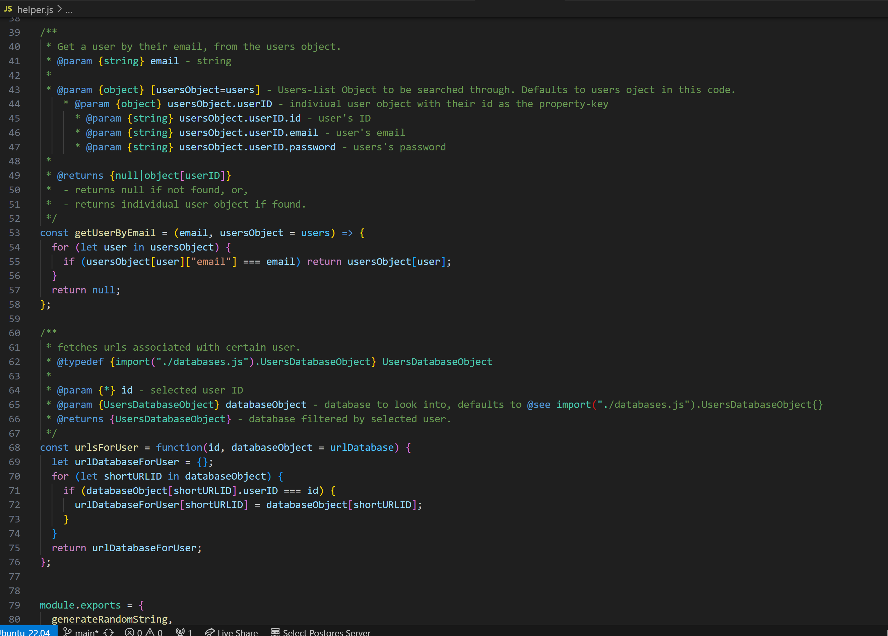
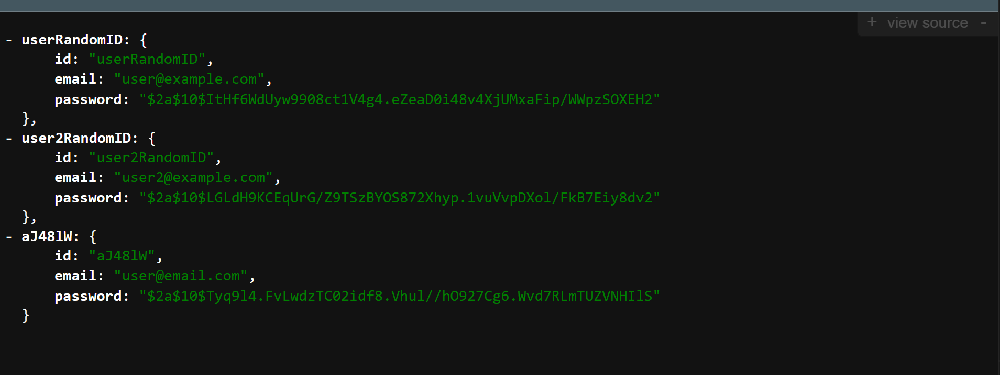
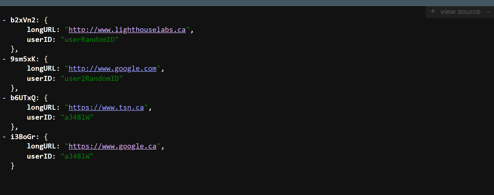

# ***TinyApp*** Tech Specs

> [!TIP]
> - [<< Back to : `README.md` << ](../../README.md) 
> - [>> Jump to  : `CHANGELOG.md` >> ](../../CHANGELOG.md) 
> - [>> Jump to : `docs/USERGUIDE.md` >> ](./USERGUIDE.md)

## Stack & Dependencies

- Web Server: **`Node.js`**
- Middleware: **`Express`**
- Template Engine: **`EJS`**
- *Database: None ( Hardcoded-Object-demo & In-Memory Object )*
- Styling: **`Bootstap`**
- Other Dependencies
    - `bcryptjs`
    - `cookie-session`
    - `~~cookie-parser~~`
- Dev Dependencies
    - `nodemon`
    - `mocha`
    - `chai`

## Routes

By default on `http://localhost:8080/` 

| `GET /`  | Home |
| --- | --- |
| `GET /urls.json` | ( Demo Courtesy ) Lists all hardcoded demo URLs in database in JSON format |
| `GET /register` | Renders Register page and form. |
| `POST /register` | Creates New user with encrypted password, set cookie, & redirect to `/urls`. |
| `GET /login`  | Renders Login page and form. |
| `POST /login` | Login by setting cookie, redirect to `/urls`. |
| `POST /logout` | Delete cookie, logout & redirects to `/login`. |
| `GET /urls` | Lists URLs of Logged in User. |
| `GET /urls/new` | Renders New URL page and form. |
| `GET /urls/:id` | Renders selected URL page with an update form. |
| `GET /u/:id` | Redirects selected URL to Target long URL. |
| `POST /urls` | Creates new URL for logged in user. |
| `POST /urls/:id` | Updates selected  URL’s target long URL. |
| `POST /urls/:id/delete` | Delete Selected URL. |
---

## Dev Features

- Descriptive Comments in JSDoc format
- Custom Helper Functions middleware
    

- ### Sample API 

    As a demo courtesy, and a sample JSON API : 
    → 2 lists of hardcoded and thereafter in-memory databases of 

    - `Users` : visit → [`http://localhost:8080/users.json`](http://localhost:8080/users.json)
    - `URLs` : visit → [`http://localhost:8080/urls.json`](http://localhost:8080/urls.json)

    
    

- ### Unit-Test
    - Unit-Test-Automated (Partial TDD) using Mocha & Chai
    - Run `npm test` to check it out.
    